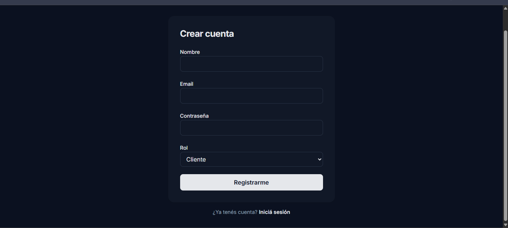
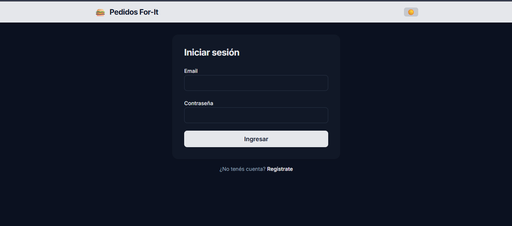

# Proyecto Final — Academia For-It (pedidos de comida)

Monorepo con **arquitectura limpia + TDD + TypeScript**. Tres entregas encadenadas:
dominio → backend → frontend → docker-compose.

## Estructura

```
proyecto-final/
├── package.json            # raíz (workspaces, tooling: vitest, eslint, tsc)
├── pnpm-workspace.yaml
├── tsconfig.base.json      # config TS compartida (strict, noEmit)
├── vitest.config.ts
├── eslint.config.js
├── domain/                 # capa de dominio (pura, sin dependencias externas)
│   ├── package.json        # @proyecto/domain
│   ├── tsconfig.json
│   └── src/
│       ├── entities/       # entidades (con identidad): User, Order, ...
│       ├── use-cases/      # casos de uso (reglas de aplicación)
│       ├── services/       # puertos (interfaces): PasswordHasher, repos, ...
│       ├── value-objects/  # value objects (sin identidad): Money, Email, ...
│       │   ├── Money.ts
│       │   └── Money.test.ts
│       └── index.ts        # barrel
└── apps/                   # backend / frontend (más adelante)
```

## Comandos (desde la raíz)

```bash
pnpm install          # instala dependencias del workspace
pnpm test             # corre todos los tests (vitest run)
pnpm test:watch       # tests en modo watch (para el ciclo TDD)
pnpm typecheck        # tsc --noEmit en cada paquete
pnpm lint             # eslint
pnpm check            # typecheck + lint + test (gate completo)
```

## Flujo de trabajo TDD

Rojo → Verde → Refactor, un comportamiento a la vez:
1. Escribir un test que falle (rojo).
2. Implementar lo mínimo para que pase (verde).
3. Refactorizar con los tests en verde.

Los tests van **co-localizados** junto al archivo que prueban (`X.ts` + `X.test.ts`).

## Backend (`apps/backend`)

API Express que expone los casos de uso del dominio. Los puertos se implementan
con adaptadores reales (bcrypt, JWT, `crypto.randomUUID`) y, por ahora,
repositorios **en memoria** (se cambiarán por Postgres en la entrega de Docker).
El `container.ts` es el *composition root*: el único lugar que conoce las
implementaciones concretas.

```bash
pnpm --filter @proyecto/backend dev     # levanta el server (tsx watch) en :3000
```

Endpoints iniciales (auth):
- `GET  /health`
- `POST /api/auth/register`  → `{ name, email, password, role }`
- `POST /api/auth/login`     → `{ email, password }` → `{ token, user }`
- `GET  /api/auth/me`        → requiere `Authorization: Bearer <token>`

## Base de datos (Docker + Prisma) — entrega 3

Postgres se levanta con Docker; el backend puede persistir en memoria (default)
o en Postgres vía Prisma (toggle `PERSISTENCE`).

Setup (una vez):
```bash
docker compose up -d                              # Postgres en :5432
cd apps/backend && cp .env.example .env           # ajustá DATABASE_URL/JWT_SECRET
pnpm --filter @proyecto/backend prisma:generate   # genera el cliente Prisma
pnpm --filter @proyecto/backend prisma:migrate    # crea las tablas (migración inicial)
```
Correr el backend contra Postgres:
```bash
PERSISTENCE=prisma pnpm --filter @proyecto/backend dev
```
> Nota: el `schema.prisma` espeja el dominio (dinero en centavos + moneda,
> dirección embebida). Los adaptadores Prisma reconstruyen los value objects y
> usan `Order.rehydrate`/`Cart.rehydrate` al leer. **El dominio y los casos de
> uso NO cambian**: solo se enchufa otro adaptador — ese es el pago de la
> arquitectura limpia.

## Uso de la aplicación

Levantar en dos terminales:
```bash
pnpm --filter @proyecto/backend dev     # API en :3000 (persistencia en memoria por defecto)
pnpm --filter @proyecto/web dev         # Frontend en :5173
```
Luego abrir **http://localhost:5173**.

### Crear cuenta y elegir rol



En **Crear cuenta** se ingresa nombre, email y contraseña, y se elige un **rol**. Al registrarse, la sesión queda iniciada automáticamente. Cada rol ve una app distinta:

- **Cliente**: pide comida (Restaurantes → menú → carrito → checkout → seguimiento) y consulta **Mis pedidos**.
- **Admin**: crea su restaurante, carga el menú y **gestiona los pedidos** (Confirmar → Preparar → Despachar), pudiendo además **asignar un repartidor**.
- **Repartidor**: ve **Mis entregas** y marca los pedidos como entregados.

### Iniciar sesión



Con email y contraseña. El menú de navegación se adapta al rol del usuario. El botón 🌙/☀️ del header alterna entre tema **claro y oscuro** (la preferencia se recuerda).

### Comportamiento esperado (flujo completo)

1. El **cliente** arma un pedido y lo confirma → queda en estado **Pendiente**.
2. El **admin** lo **Confirma → Prepara → Despacha** (cada acción actualiza el estado en el acto) y le **asigna un repartidor**.
3. El pedido pasa a **En camino**; el **repartidor** lo marca como **Entregado**.
4. El **cliente** ve el estado actualizado en **Mis pedidos** / seguimiento.

> En modo memoria (por defecto) los datos se reinician cada vez que se reinicia el backend. Para persistencia real, ver la sección de Docker + Prisma.
